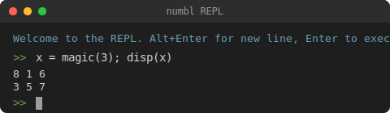

# Numbl

Numbl is an open-source numerical computing environment that aims to be compatible with Matlab.

**Early stage project.** Numbl is under active development and new functionality is being added regularly.

[Intro presentation](https://magland.github.io/mip-numbl-presentation)

## Try it in the browser

The full browser IDE with file management and plotting is at <https://numbl.org>. No installation required; all execution happens locally in your browser.

[](https://numbl.org/embed-repl)

Or try the [embedded REPL](https://numbl.org/embed-repl) for a quick interactive session.

Numbl scripts can also be embedded in HTML and Markdown pages (including GitHub Pages). See the [numbl-embed-example](https://magland.github.io/numbl-embed-example/) for usage and a [live demo](https://magland.github.io/numbl-embed-example/example1).

## Command-line usage

For full performance, use the command-line version. If you have Node.js installed, you can run numbl directly with `npx` (no install needed):

```bash
npx numbl                      # interactive REPL
npx numbl eval "disp(eye(3))"  # evaluate inline code
npx numbl run script.m         # run a .m file
```

Or install globally for regular use:

```bash
npm install -g numbl
```

To enable fast linear algebra, build the native LAPACK addon:

```bash
# Prerequisites: C++ compiler, libopenblas-dev, libfftw3-dev (or equivalents for your OS)
numbl build-addon
```

## Usage

<!-- BEGIN CLI HELP -->
```
Usage: numbl <command> [options]

Commands:
  run <file.m>       Run a .m file
  eval "<code>"      Evaluate inline code
  run-tests [dir]    Run .m test scripts (default: numbl_test_scripts/)
  build-addon        Build native LAPACK addon
  info               Print machine-readable info (JSON)
  list-builtins      List available built-in functions (--no-help: only those without help text)
  (no command)       Start interactive REPL

Global options:
  --version, -V      Print version and exit
  --help, -h         Print this help message

Options (for REPL):
  --plot             Enable plot server
  --plot-port <port> Set plot server port (implies --plot)

Options (for run and eval):
  --dump-js <file>   Write JIT-generated JavaScript to file
  --dump-ast         Print AST as JSON
  --verbose          Detailed logging to stderr
  --stream           NDJSON output mode
  --path <dir>       Add extra workspace directory
  --plot             Enable plot server
  --plot-port <port> Set plot server port (implies --plot)
  --add-script-path  Add the script's directory to the workspace (run only)
  --opt <level>      Optimization level (0=none, 1=JIT scalar functions; default: 1)

Environment variables:
  NUMBL_PATH         Extra workspace directories (separated by :)
```
<!-- END CLI HELP -->

## Library usage

numbl can also be used as an npm library in Node.js or the browser:

```js
import { executeCode } from "numbl";

const result = executeCode('disp(2 + 3)');
console.log(result.output); // ["5\n"]
```

See [docs/library-usage.md](docs/library-usage.md) for the full API, and the example repos: [Node.js](https://github.com/magland/numbl-example-node), [browser](https://github.com/magland/numbl-example-browser).

## VS Code extension

The [Numbl extension for VS Code](https://marketplace.visualstudio.com/items?itemName=jmagland.numbl) lets you run `.m` scripts directly in the editor with inline error diagnostics and a built-in figure viewer.

## Upgrading

```bash
npm install -g numbl@latest
```

Note: if you previously built the native addon, you'll need to run `numbl build-addon` again after upgrading.

## MATLAB Compatibility

See [docs/matlab-compatibility.md](docs/matlab-compatibility.md) for a detailed table of supported MATLAB features, including >400 builtin functions, plotting, data types, and language constructs.

## Authors

Jeremy Magland and Dan Fortunato, Center for Computational Mathematics, Flatiron Institute.

## License

Apache 2.0.

## Acknowledgements

See [acknowledgements.md](docs/acknowledgements.md).
